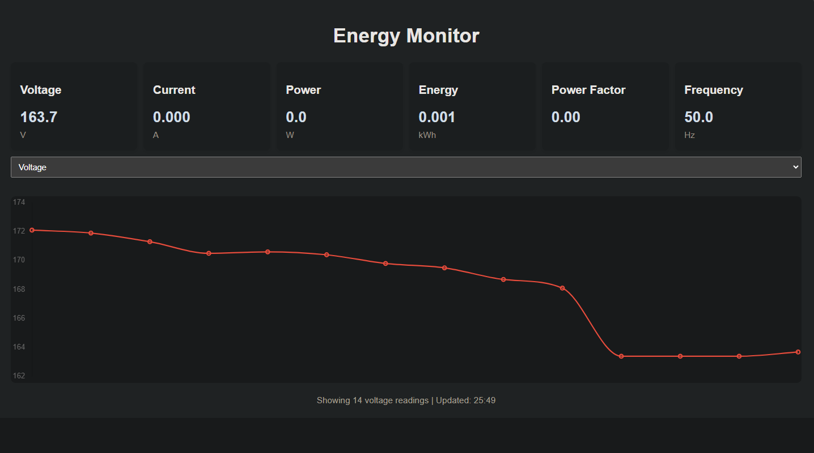

# ⚡ ESP8266 Energy Monitor with Web Dashboard

A web-based energy monitoring project using the ESP8266 and PZEM-004T v3. It reads real-time electrical parameters like voltage, current, power, and energy consumption, and displays them via a responsive web interface with auto-updating charts powered by Chart.js.

---

## 🚀 Features

- 📡 Wi-Fi-enabled ESP8266 microcontroller
- 🔌 Measures:
  - Voltage (V)
  - Current (A)
  - Active Power (W)
  - Energy (kWh)
  - Power Factor
  - Frequency (Hz)
- 📊 Real-time line chart for selected parameter (voltage/current/power/energy)
- 🖥️ Responsive Web UI with auto-refresh (every 2s)
- 📡 mDNS support for easy access (`http://pzem.local`)
- 🌐 JSON API endpoint for easy integration

---

## 🛠️ Hardware Requirements

- ESP8266 board (e.g., NodeMCU or Wemos D1 Mini)
- PZEM-004T v3 energy meter
- Voltage divider (for RX pin protection)
- Power source (USB or external)

---

## 📦 Libraries Used

Install the following libraries via the Arduino Library Manager:

- `ESP8266WiFi`
- `ESP8266WebServer`
- `ESP8266mDNS`
- `SoftwareSerial`
- [`PZEM004Tv30`](https://github.com/mandulaj/PZEM-004T-v30)

---

## 🔧 Wiring Guide

| ESP8266 Pin | PZEM-004T Pin |
|-------------|---------------|
| D6 (RX)     | TX            |
| D7 (TX)     | RX            |
| GND         | GND           |
| 5V / VIN    | VCC           |

**Note:** Use a voltage divider on the PZEM's TX line to bring it down to 3.3V logic for the ESP8266's RX (D6).

---

## 📁 Files

- `main.ino` – Arduino sketch with web server and data handling
- Embedded HTML + JS for the dashboard is included in the sketch as a raw literal

---

## 🌐 How to Use

1. Flash the code to your ESP8266.
2. Connect the ESP to your Wi-Fi (SSID and password set in code).
3. Open a browser and visit:
   - `http://<your_esp_ip>` or
   - `http://pzem.local` (if mDNS is supported on your network)
4. View real-time metrics and graphs.

---

## 🧪 API Endpoint

`GET /data`

Returns JSON:
```json
{
  "v": 230.5,
  "c": 0.432,
  "p": 99.6,
  "e": 12.456,
  "pf": 0.98,
  "f": 50.0
}
```

---

## 🧰 Customization Tips

- Change `maxPoints` in JavaScript to keep more data points in the chart.
- Add more styling or page sections using the embedded HTML/CSS.
- Use the `/data` endpoint with MQTT or Node-RED for further automation.

---

## ⚠️ Security Note

Wi-Fi credentials are hardcoded in the sketch. For production use:
- Add a configuration interface or
- Store credentials in EEPROM / SPIFFS
- Consider basic auth or token protection for the API

---

## 📸 Screenshot

> 

---

## 📃 License

This project is released under the MIT License.
